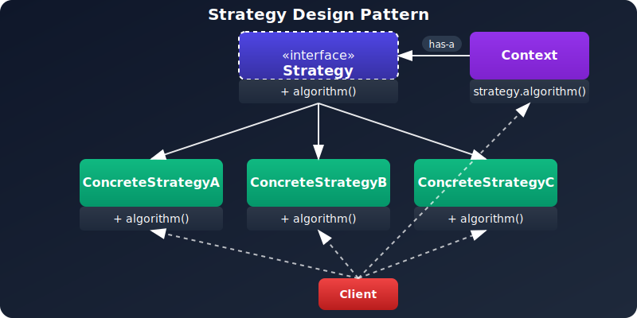

# Strategy Pattern

## Definition
Define a family of algorithms, encapsulate each one, and make them interchangeable.

## Understanding the Strategy Pattern
The Strategy pattern is a **behavioral design pattern** that enables selecting an algorithm at runtime. It defines a family of algorithms, encapsulates each one, and makes them interchangeable. The pattern allows the algorithm to vary independently from clients that use it.

---

## Problem
Imagine you're developing an application that needs to implement various algorithms for different operations, such as:

- Data validation
- Sorting
- Payment processing

As your application grows, you'll end up with many conditional statements to choose the right algorithm. This leads to:

- Hard-to-maintain code
- Violation of the Open/Closed Principle
- Difficulty adding new algorithms without modifying existing code

---


## Laravel Exmaple on Payments Gateways

# Deep Dive: Dependency Inversion Principle in Your Payment Gateway Example

Let's analyze how your payment gateway implementation perfectly demonstrates the **Dependency Inversion Principle (DIP)** from SOLID principles.

## Understanding DIP

The principle states:
1. **High-level modules should not depend on low-level modules. Both should depend on abstractions.**
2. **Abstractions should not depend on details. Details should depend on abstractions.**

## Applying DIP to Your Payment System

### 1. The Abstraction (Contract)
```php
// app/Contracts/PaymentGatewayInterface.php
interface PaymentGatewayInterface
{
    public function charge(float $amount, array $options);
    public function refund(string $transactionId, float $amount);
    public function verifyPayment(string $transactionId);
}
```

This interface is the **abstraction** that both high-level and low-level components will depend on.

### 2. High-Level Module
```php
// app/Services/Payments/PaymentService.php
class PaymentService
{
    protected PaymentGatewayInterface $gateway;

    public function __construct(PaymentGatewayInterface $gateway)
    {
        $this->gateway = $gateway;
    }
    
    public function processPayment(float $amount) 
    {
        return $this->gateway->charge($amount, []);
    }
}
```

Key points:
- **Depends on the interface** (`PaymentGatewayInterface`), not concrete implementations
- Doesn't care whether it's Stripe, Paymob, or MyFatoorah
- Only knows about the contract's methods (`charge`, `refund`, `verifyPayment`)

### 3. Low-Level Modules
```php
// app/Services/Payments/StripeGateway.php
class StripeGateway implements PaymentGatewayInterface { /* ... */ }

// app/Services/Payments/PaymobGateway.php
class PaymobGateway implements PaymentGatewayInterface { /* ... */ }

// app/Services/Payments/MyFatoorahGateway.php
class MyFatoorahGateway implements PaymentGatewayInterface { /* ... */ }
```

Key points:
- Each **depends on the same abstraction** (`implements PaymentGatewayInterface`)
- Contains implementation details specific to their payment provider
- Can be changed/modified without affecting the high-level `PaymentService`

### 4. The Glue: Service Provider
```php
// app/Providers/PaymentServiceProvider.php
$this->app->bind(PaymentGatewayInterface::class, function ($app) {
    return match(config('payment.default')) {
        'stripe' => new StripeGateway(),
        'paymob' => new PaymobGateway(),
        'myfatoorah' => new MyFatoorahGateway()
    };
});
```

This is where the **inversion of control** happens - the provider decides which concrete implementation to inject.

## Practical Benefits in Your Example

1. **Easy to Add New Gateways**:
   - Create a new class implementing `PaymentGatewayInterface`
   - Update the service provider
   - No changes needed in `PaymentService`

2. **Runtime Switching**:
   ```php
   // Can change gateway based on conditions
   $gateway = $isInternational ? new StripeGateway() : new PaymobGateway();
   $paymentService = new PaymentService($gateway);
   ```

3. **Testing Made Simple**:
   ```php
   // Easy to mock
   $mockGateway = $this->createMock(PaymentGatewayInterface::class);
   $mockGateway->method('charge')->willReturn('success');
   $service = new PaymentService($mockGateway);
   ```

4. **Clear Architectural Boundaries**:
   - Contracts define the "what"
   - Services implement the "how"
   - PaymentService only knows the "what"

## Violating DIP (Anti-Pattern)

Without contracts, your code might look like this:
```php
class PaymentService
{
    protected StripeGateway $gateway; // Direct dependency
    
    public function __construct()
    {
        $this->gateway = new StripeGateway(); // Concrete instantiation
    }
}
```

Problems this causes:
1. Impossible to change gateways without modifying `PaymentService`
2. Hard to test (real Stripe API would be called)
3. Tight coupling makes the system rigid

## Real-World Extension Example

Imagine adding PayPal support:
1. Create `PayPalGateway.php` implementing `PaymentGatewayInterface`
2. Update the service provider's match statement
3. Done! No other files need modification

This is the power of depending on abstractions rather than concrete implementations.


## Solution
The Strategy Pattern suggests:

- Defining a family of algorithms
- Placing each one into a separate class
- Making them interchangeable at runtime

This isolates the algorithm implementation from the code that uses it, allowing you to vary or add algorithms independently.

---

## Structure



- **Strategy**: Declares a common interface for all supported algorithms.
- **Concrete Strategies**: Implement the different variations of an algorithm.
- **Context**: Maintains a reference to a Strategy object and uses it.
- **Client**: Creates a strategy and sets it in the context.

---

## When to Use

- You need different variants of an algorithm.
- You have multiple classes differing only in behavior.
- You want to isolate algorithm details from users.
- You want to adhere to the Open/Closed Principle.

---

## Benefits

✅ Algorithms are interchangeable at runtime  
✅ Implementation details are hidden  
✅ Promotes composition over inheritance  
✅ New strategies can be added without changing existing code

---

## Real-World Use Cases

- Sorting Algorithms  
- Payment Processing  
- Compression Techniques  
- Authentication (OAuth, JWT, etc.)  
- Tax Calculation by Region  

---

## JavaScript Example: Payment Strategies

```js
// Strategy Interface
class PaymentStrategy {
  pay(amount) {
    throw new Error("pay() must be implemented");
  }
}

// Concrete Strategies
class CreditCardStrategy extends PaymentStrategy {
  constructor(cardNumber, name, cvv, expirationDate) {
    super();
    this.cardNumber = cardNumber;
    this.name = name;
    this.cvv = cvv;
    this.expirationDate = expirationDate;
  }

  pay(amount) {
    console.log(`Paid $${amount} using Credit Card`);
  }
}

class PayPalStrategy extends PaymentStrategy {
  constructor(email, password) {
    super();
    this.email = email;
    this.password = password;
  }

  pay(amount) {
    console.log(`Paid $${amount} using PayPal`);
  }
}

class CryptoStrategy extends PaymentStrategy {
  constructor(walletAddress) {
    super();
    this.walletAddress = walletAddress;
  }

  pay(amount) {
    console.log(`Paid $${amount} using Crypto`);
  }
}

// Context
class ShoppingCart {
  constructor() {
    this.items = [];
    this.paymentStrategy = null;
  }

  addItem(item) {
    this.items.push(item);
  }

  setPaymentStrategy(strategy) {
    this.paymentStrategy = strategy;
  }

  calculateTotal() {
    return this.items.reduce((sum, item) => sum + item.price, 0);
  }

  checkout() {
    if (!this.paymentStrategy) {
      throw new Error("Payment strategy not set.");
    }
    const total = this.calculateTotal();
    this.paymentStrategy.pay(total);
  }
}

// Usage
const cart = new ShoppingCart();
cart.addItem({ name: "Product 1", price: 100 });
cart.addItem({ name: "Product 2", price: 50 });

cart.setPaymentStrategy(new CreditCardStrategy("1234 5678 9012 3456", "John Doe", "123", "12/25"));
cart.checkout();

cart.setPaymentStrategy(new PayPalStrategy("john@example.com", "password123"));
cart.checkout();
