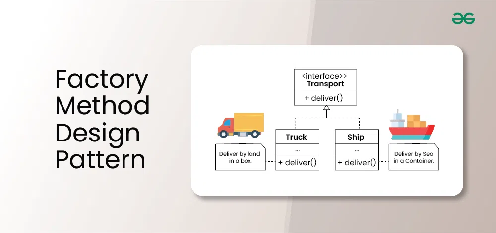

### **Factory Method Design Pattern**

The **Factory Method Design Pattern** is a creational design pattern that provides an interface for creating objects in a superclass but allows subclasses to alter the type of objects that will be created. 

---

### **Problem Solved by Factory Method**
1. **Object Creation Flexibility**: When the exact type of object isn't known beforehand, the Factory Method delegates the responsibility of object creation to subclasses.
2. **Code Maintainability**: Instead of hardcoding the object creation in your code, you encapsulate it in a factory method, making the code more maintainable.
3. **Scalability**: Adding new types of objects does not require modifying existing code, adhering to the Open/Closed Principle.

---

### **Real-World Example**

#### **Scenario**
Imagine you are building a logistics management system. The system should handle deliveries by **trucks** for land logistics and **ships** for sea logistics.  
The delivery mechanism differs based on the mode of transportation:
- **Problem**: Hardcoding the logic for different transportation methods leads to tight coupling and makes the code inflexible for adding new types of logistics.
- **Solution**: Use the Factory Method pattern to delegate the creation of transport objects to subclasses.

---

### **Code Example: Logistics System**



Here’s an example of the Factory Method Design Pattern implemented in PHP:

---

```php
<?php

// Step 1: Define the Product Interface
interface Transport {
    public function deliver(): string;
}

// Step 2: Implement Concrete Products
class Truck implements Transport {
    public function deliver(): string {
        return "Delivering cargo by land using a Truck.";
    }
}

class Ship implements Transport {
    public function deliver(): string {
        return "Delivering cargo by sea using a Ship.";
    }
}

// Step 3: Create the Creator (Factory) Class
abstract class Logistics {
    // Factory Method
    abstract public function createTransport(): Transport;

    // Business logic that uses the factory method
    public function planDelivery(): string {
        $transport = $this->createTransport();
        return $transport->deliver();
    }
}

// Step 4: Implement Concrete Creators
class RoadLogistics extends Logistics {
    public function createTransport(): Transport {
        return new Truck();
    }
}

class SeaLogistics extends Logistics {
    public function createTransport(): Transport {
        return new Ship();
    }
}

// Step 5: Client Code
function clientCode(Logistics $logistics) {
    echo $logistics->planDelivery() . PHP_EOL;
}

// Example usage
echo "Using Road Logistics:" . PHP_EOL;
$roadLogistics = new RoadLogistics();
clientCode($roadLogistics);

echo PHP_EOL;

echo "Using Sea Logistics:" . PHP_EOL;
$seaLogistics = new SeaLogistics();
clientCode($seaLogistics);

```

---

### **Output**
```
Using Road Logistics:
Delivering cargo by land using a Truck.

Using Sea Logistics:
Delivering cargo by sea using a Ship.
```

---

### **Explanation**
1. **Product Interface**: 
   - `Transport` defines a common interface for all transport types (`Truck`, `Ship`).
2. **Concrete Products**:
   - `Truck` and `Ship` are specific implementations of `Transport`.
3. **Creator (Factory)**:
   - `Logistics` defines the `createTransport()` method that subclasses override to specify the type of transport.
   - The `planDelivery()` method uses the `createTransport()` method to get the transport object and deliver the goods.
4. **Concrete Creators**:
   - `RoadLogistics` creates a `Truck`.
   - `SeaLogistics` creates a `Ship`.
5. **Client Code**:
   - The client code works with the abstract `Logistics` class and doesn’t worry about the specific transport type.

---

### **Advantages**
1. **Decouples Object Creation**: The client code doesn’t need to know the exact class of the object being created.
2. **Adheres to Open/Closed Principle**: Adding new transport types (e.g., `Airplane`) doesn’t require changes to existing code, just a new subclass.
3. **Encapsulation of Logic**: Object creation logic is centralized in the factory method.

---

### **Real-Life Applications of Factory Method**
1. **Cross-platform UI Libraries**:
   - Create different UI elements (e.g., buttons, checkboxes) for various operating systems using factory methods.
2. **Database Connection**:
   - Factories produce database connections (e.g., MySQL, PostgreSQL) depending on configuration.
3. **Document Management**:
   - Generating different document formats (e.g., PDF, Word, Excel) using a factory.

--- 

### **Summary**
The **Factory Method Design Pattern** is useful when:
- You need flexibility in object creation.
- The exact type of object is determined dynamically.
- You want to follow the Open/Closed Principle by allowing new object types without changing existing code.